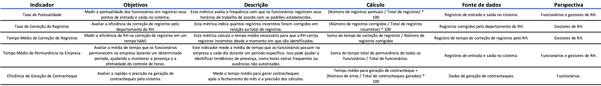
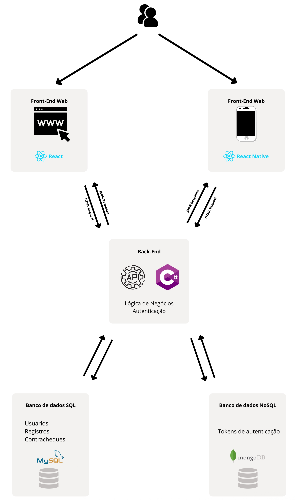

# Especificações do Projeto

Pré-requisitos: <a href="1-Documentação de Contexto.md"> Documentação de Contexto</a>

Definição do problema e ideia de solução a partir da perspectiva do usuário. É composta pela definição do  diagrama de personas, histórias de usuários, requisitos funcionais e não funcionais além das restrições do projeto.

Apresente uma visão geral do que será abordado nesta parte do documento, enumerando as técnicas e/ou ferramentas utilizadas para realizar a especificações do projeto

## Personas

As ***personas*** que ilustram nosso público-alvo são mostradas nas tabelas a seguir: 
| `USUÁRIO` |`MOTIVAÇÕES`| `FRUSTRAÇÕES` | `HOBBIES / APLICATIVOS` |
|----------------------|--------------------|--------------------|------------------------|
|
**Gabriel Toledo** **30** anos, Designer Gráfico. | Está tendo sua primeira experiência com trabalho hibrído. |Sempre encontra inconscitências nos seus registros de horário, dessa forma não recebe as horas extras corretamente | Ler livros, Assistir seriados e filmes, jogos de computador / Linkedin, Trello, Figma |
|||||
| 
 **Rafael Lange** **23** anos, Cadeirante e com dificuldade de fala, ocupa um cargo PCD em uma grande empresa, mas almeja ir para área de Design e por isso faz cursos online.|Mudar de área, Ajudar a família, Sair com os amigos, Ser aceito|Sofre preconceito por conta da sua condição, Ter poucos amigos, Vida amorosa instável| Jogar jogos no computador, Assistir streams de jogos,Assistir séries/filmes.
 |||||
| 
 **Aline Fukushima** **19** Estudante, busca ser uma desenvolvedora de software.|Ingressar no mercado de desenvolvimento, Comprar um novo computador, Sair com os amigos|Não ter estabilidade financeira, Não ter experiência de trabalho, Pouco poder de compra|Jogar jogos online, Assistir streams de jogos, Ler notícias de e-sports, Pokémon TCG, Fortnite, Minecraft, League of Legends.
  |||||
| 
 **Joana Alencar** **28** Auxiliar de produção, busca mudar de área após nova formação acadêmica.|Ingressar no mercado de programação,	Ampliar renda salarial,	Independência financeira, Conhecer novos jogos|Instabilidade financeira, Pouco poder de compra, Dificuldade de socialização|Jogar videogame, Navegar pelas redes sociais, Leitura Geek, Stardew Valley, The Sims, Fall Guys.
|||||
| 
 **Gabriela Cândido** **35** anos Recepcionista, busca migrar para programação e frequenta cursos online sobre o assunto.|Ampliar renda salarial, Independência financeira, Morar em outro país, Mudar de profissão|Problemas familiares, Insegurança pessoal|Ler livros, Ir à academia, Praticar yoga, Jogar no celular, Candy Crush, Summoners War, Clash Royalle.
 |||||
| 
 **Rogério Miranda** **46** anos, Professor, busca aperfeiçoamento na área a partir de cursos online.|Ampliar círculo social, Fazer Doutorado, Aprender novas tecnologias|Dificuldade com relacionamento amoroso, Sente-se ultrapassado tecnologicamente|Ler livros, Praticar Artes Marciais, Escrever, Jogar jogos que estimulem o raciocínio, Xadrez, Sudoku, Poker

## Histórias de Usuários

Com base na análise das personas forma identificadas as seguintes histórias de usuários:

|EU COMO... `PERSONA`| QUERO/PRECISO ... `FUNCIONALIDADE` |PARA ... `MOTIVO/VALOR`                 |
|--------------------|------------------------------------|----------------------------------------|
|Usuário do sistema  | Registrar minhas tarefas           | Não esquecer de fazê-las               |
|Administrador       | Alterar permissões                 | Permitir que possam administrar contas |

Apresente aqui as histórias de usuário que são relevantes para o projeto de sua solução. As Histórias de Usuário consistem em uma ferramenta poderosa para a compreensão e elicitação dos requisitos funcionais e não funcionais da sua aplicação. Se possível, agrupe as histórias de usuário por contexto, para facilitar consultas recorrentes à essa parte do documento.

> **Links Úteis**:
> - [Histórias de usuários com exemplos e template](https://www.atlassian.com/br/agile/project-management/user-stories)
> - [Como escrever boas histórias de usuário (User Stories)](https://medium.com/vertice/como-escrever-boas-users-stories-hist%C3%B3rias-de-usu%C3%A1rios-b29c75043fac)
> - [User Stories: requisitos que humanos entendem](https://www.luiztools.com.br/post/user-stories-descricao-de-requisitos-que-humanos-entendem/)
> - [Histórias de Usuários: mais exemplos](https://www.reqview.com/doc/user-stories-example.html)
> - [9 Common User Story Mistakes](https://airfocus.com/blog/user-story-mistakes/)

## Modelagem do Processo de Negócio 

### Análise da Situação Atual

Apresente aqui os problemas existentes que viabilizam sua proposta. Apresente o modelo do sistema como ele funciona hoje. Caso sua proposta seja inovadora e não existam processos claramente definidos, apresente como as tarefas que o seu sistema pretende implementar são executadas atualmente, mesmo que não se utilize tecnologia computacional. 

### Descrição Geral da Proposta

Apresente aqui uma descrição da sua proposta abordando seus limites e suas ligações com as estratégias e objetivos do negócio. Apresente aqui as oportunidades de melhorias.

### Processo 1 – NOME DO PROCESSO

Apresente aqui o nome e as oportunidades de melhorias para o processo 1. Em seguida, apresente o modelo do processo 1, descrito no padrão BPMN. 

### Processo 2 – NOME DO PROCESSO

Apresente aqui o nome e as oportunidades de melhorias para o processo 2. Em seguida, apresente o modelo do processo 2, descrito no padrão BPMN.

## Indicadores de Desempenho

## Requisitos

As tabelas que se seguem apresentam os requisitos funcionais e não funcionais que detalham o escopo do projeto. Para determinar a prioridade de requisitos, aplicar uma técnica de priorização de requisitos e detalhar como a técnica foi aplicada.

### Requisitos Funcionais

|ID    | Descrição do Requisito  | Prioridade |
|------|-----------------------------------------|----|
|RF-001| O funcionário poderá fazer login no sistema | ALTA | 
|RF-002| O funcionário deve poder registrar sua entrada e saída no trabalho | ALTA |
|RF-003| O funcionário deve ser capaz de visualizar todos os registros de pontos anteriores | MÉDIA |
|RF-004| O sistema deve calcular e exibir o total de horas trabalhadas pelo funcionário em um determinado mês | ALTA |
|RF-005| O funcionário poderá visualizar seu contracheque | BAIXA |
|RF-006| O RH pode criar uma conta para empresa | ALTA |
|RF-007| O RH pode fazer login no sistema | ALTA |
|RF-008| O RH deve poder fazer um CRUD dos departamentos no sistema | MÉDIA |
|RF-009| O RH deve poder fazer um CRUD das justificativas no sistema | MÉDIA |
|RF-010| O RH pode fazer filtros nos usuários pelo nome ou departamento | MÉDIA |
|RF-011| O RH pode fazer filtros nos registros de ponto por um período de dias determinado | MÉDIA |
|RF-012| O RH deve poder fazer um CRUD dos usuários (empregados) no sistema | ALTA |
|RF-013| O RH deve ter acesso à visualização dos registros de pontos de todos os usuários | ALTA |
|RF-014| O RH deve poder corrigir os registros de pontos, incluindo adição de justificativa e inclusão, alteração, exclusão de horários incorretos | ALTA |
|RF-015| O RH poderá fazer um CRUD do contracheque do empregado | BAIXA |
|RF-016| O RH poderá fazer um CRUD dos cargos da empresa | MÉDIA |

### Requisitos não Funcionais

|ID     | Descrição do Requisito  |Prioridade |
|-------|-------------------------|----|
|RNF-001| Os dados sensíveis, como informações de login, devem ser armazenados de forma segura| MÉDIA | 
|RNF-002| O sistema deve ser responsivo e lidar com muitos registros de pontos e usuários |  BAIXA | 
|RNF-002| O tempo de resposta para ações como bater o ponto e exibir registros de pontos deve ser rápido |  BAIXA | 
|RNF-002| A interface do usuário deve ser intuitiva e fácil de usar, tanto no aplicativo web (React) quanto no aplicativo mobile (React Native) |  BAIXA | 
|RNF-002| O sistema deve estar disponível a maior parte do tempo, minimizando o tempo de inatividade não planejado |  BAIXA | 
|RNF-002| A aplicação deve ser compatível com diferentes navegadores e dispositivos |  BAIXA | 

## Restrições

O projeto está restrito pelos itens apresentados na tabela a seguir.

|ID| Restrição                                             |
|--|-------------------------------------------------------|
|01| O projeto deverá ser entregue até o final do semestre |
|02| O projeto projeto não pode em hipótese alguma ser terceirizado  |

Enumere as restrições à sua solução. Lembre-se de que as restrições geralmente limitam a solução candidata.

> **Links Úteis**:
> - [O que são Requisitos Funcionais e Requisitos Não Funcionais?](https://codificar.com.br/requisitos-funcionais-nao-funcionais/)
> - [O que são requisitos funcionais e requisitos não funcionais?](https://analisederequisitos.com.br/requisitos-funcionais-e-requisitos-nao-funcionais-o-que-sao/)

## Diagrama de Casos de Uso

O diagrama de casos de uso é o próximo passo após a elicitação de requisitos, que utiliza um modelo gráfico e uma tabela com as descrições sucintas dos casos de uso e dos atores. Ele contempla a fronteira do sistema e o detalhamento dos requisitos funcionais com a indicação dos atores, casos de uso e seus relacionamentos. 

As referências abaixo irão auxiliá-lo na geração do artefato “Diagrama de Casos de Uso”.

> **Links Úteis**:
> - [Criando Casos de Uso](https://www.ibm.com/docs/pt-br/elm/6.0?topic=requirements-creating-use-cases)
> - [Como Criar Diagrama de Caso de Uso: Tutorial Passo a Passo](https://gitmind.com/pt/fazer-diagrama-de-caso-uso.html/)
> - [Lucidchart](https://www.lucidchart.com/)
> - [Astah](https://astah.net/)
> - [Diagrams](https://app.diagrams.net/)

# Arquitetura Distribuída do projeto

# Matriz de Rastreabilidade

A matriz de rastreabilidade é uma ferramenta usada para facilitar a visualização dos relacionamento entre requisitos e outros artefatos ou objetos, permitindo a rastreabilidade entre os requisitos e os objetivos de negócio. 

A matriz deve contemplar todos os elementos relevantes que fazem parte do sistema, conforme a figura meramente ilustrativa apresentada a seguir.

> **Links Úteis**:
> - [Artigo Engenharia de Software 13 - Rastreabilidade](https://www.devmedia.com.br/artigo-engenharia-de-software-13-rastreabilidade/12822/)
> - [Verificação da rastreabilidade de requisitos usando a integração do IBM Rational RequisitePro e do IBM ClearQuest Test Manager](https://developer.ibm.com/br/tutorials/requirementstraceabilityverificationusingrrpandcctm/)
> - [IBM Engineering Lifecycle Optimization – Publishing](https://www.ibm.com/br-pt/products/engineering-lifecycle-optimization/publishing/)

# Gerenciamento de Projeto

De acordo com o PMBoK v6 as dez áreas que constituem os pilares para gerenciar projetos, e que caracterizam a multidisciplinaridade envolvida, são: Integração, Escopo, Cronograma (Tempo), Custos, Qualidade, Recursos, Comunicações, Riscos, Aquisições, Partes Interessadas. Para desenvolver projetos um profissional deve se preocupar em gerenciar todas essas dez áreas. Elas se complementam e se relacionam, de tal forma que não se deve apenas examinar uma área de forma estanque. É preciso considerar, por exemplo, que as áreas de Escopo, Cronograma e Custos estão muito relacionadas. Assim, se eu amplio o escopo de um projeto eu posso afetar seu cronograma e seus custos.

## Gerenciamento de Tempo

Com diagramas bem organizados que permitem gerenciar o tempo nos projetos, o gerente de projetos agenda e coordena tarefas dentro de um projeto para estimar o tempo necessário de conclusão.

O gráfico de Gantt ou diagrama de Gantt também é uma ferramenta visual utilizada para controlar e gerenciar o cronograma de atividades de um projeto. Com ele, é possível listar tudo que precisa ser feito para colocar o projeto em prática, dividir em atividades e estimar o tempo necessário para executá-las.

## Gerenciamento de Equipe

O gerenciamento adequado de tarefas contribuirá para que o projeto alcance altos níveis de produtividade. Por isso, é fundamental que ocorra a gestão de tarefas e de pessoas, de modo que os times envolvidos no projeto possam ser facilmente gerenciados. 

## Gerenciamento de Tarefas

Para organização e distribuição das tarefas do projeto, a equipe está utilizando o Trello, estruturado com as seguintes listas:

- Propriedades das Tarefas: É a etiqueta das tarefas, ou a prioridade em que serão apresentadas sendo alta cor vermelha, média cor amarela ou baixa cor verde.
- Backlog: Lista ordenada de todos os requisitos que se tem conhecimento de que precisam estar no produto. Cada tarefa está associada a um 'milestone', que pressupõe uma entrega final.
- A Fazer: Tarefas que estão disponíveis para os desenvolvedores fazer e ninguém assumiu ainda, ou seja está separada para entrega e aguardadndo o desenvolvedor assumir a resposabilidade por ela;
- Em Andamento: Quando uma tarefa do Sprint Backlog tiver sido iniciada, ela é movida para cá;
- Concluído: todas as tarefas do sprint que já foram concluídas pela equipe de desenvolvimento.
- Lembrete: uma aba com as datas das próximas entregas e a referência delas.

O quadro de organização da equipe está diponível no Trello através do link: https://trello.com/b/Wo9S7t1j/kanban-aplica%C3%A7%C3%A3o-distribu%C3%ADda-ponto-digital e está apresentado no seu estado atual na figura abaixo.

## Gestão de Orçamento

O orçamento foi desenvolvido para fins educacionais, e apresenta, de forma fictícia, valores estimados para os serviços e equipamentos necessários.

