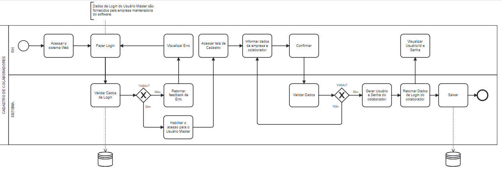
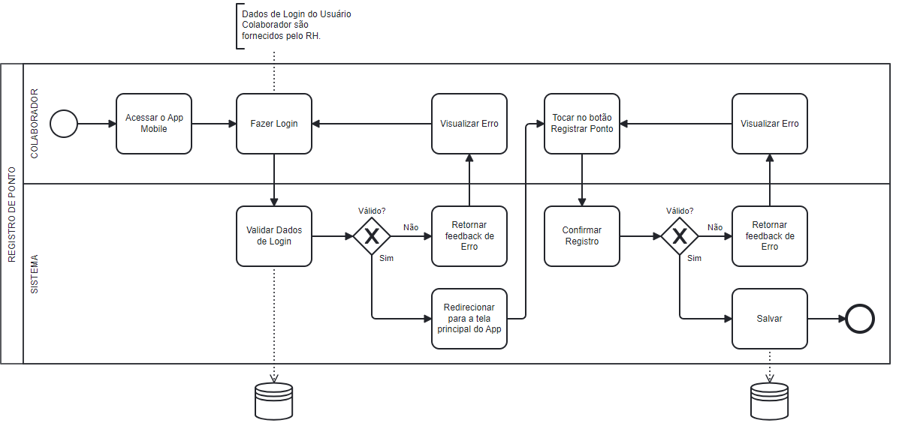
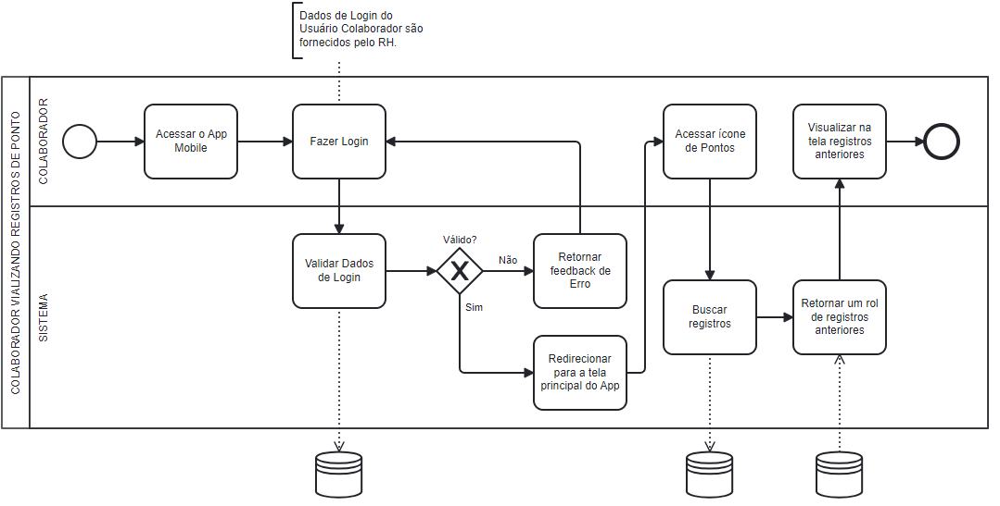
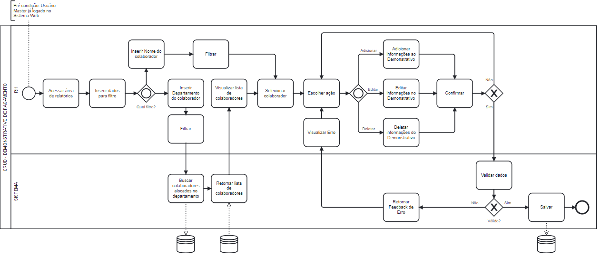
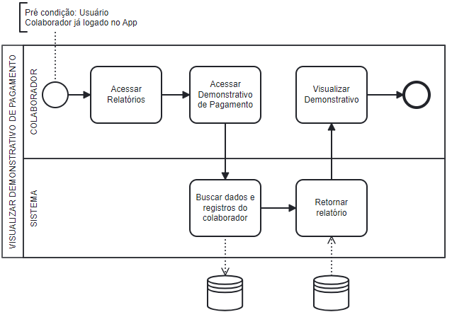
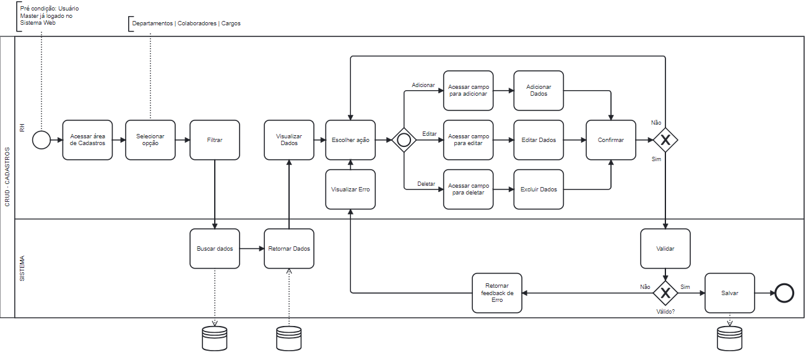
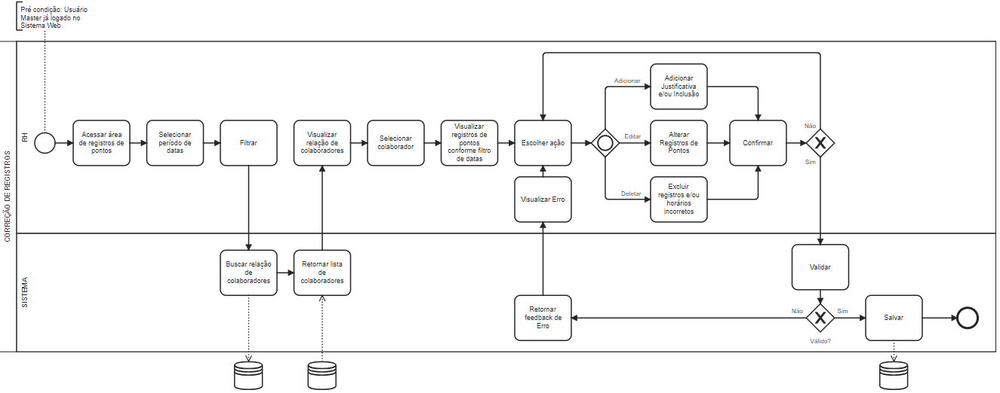
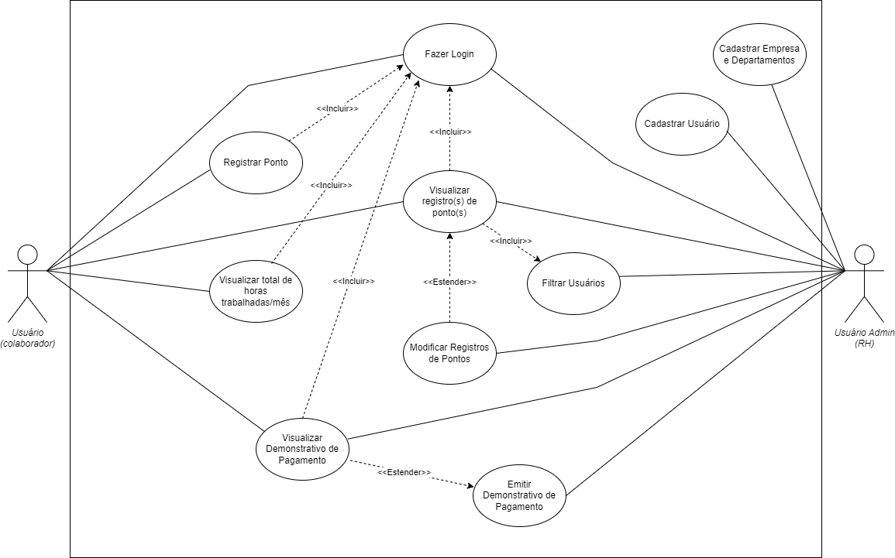

# Especificações do Projeto

Pré-requisitos: <a href="1-Documentação de Contexto.md"> Documentação de Contexto</a>

Definição do problema e ideia de solução a partir da perspectiva do usuário. É composta pela definição do  diagrama de personas, histórias de usuários, requisitos funcionais e não funcionais além das restrições do projeto.

Apresente uma visão geral do que será abordado nesta parte do documento, enumerando as técnicas e/ou ferramentas utilizadas para realizar a especificações do projeto

## Personas

As ***personas*** que ilustram nosso público-alvo são mostradas nas tabelas a seguir: 
| `USUÁRIO` |`MOTIVAÇÕES`| `FRUSTRAÇÕES` | `HOBBIES / APLICATIVOS` |
|----------------------|--------------------|--------------------|------------------------|
|
**Gabriel Velasquez,** **30 anos.** Designer Gráfico. | Está tendo sua primeira experiência com trabalho hibrído. |Sempre encontra inconscitências nos seus registros de horário, dessa forma não recebe as horas extras corretamente | Ler livros, Assistir seriados e filmes, jogos de computador / Linkedin, Trello, Figma |
|||||
|
 **Rafael Lange,** **25 anos.** Cadeirante, ocupa um cargo PCD em uma grande empresa, mas almeja ir para área de desenvolvedor e trabalhar para fora do país.| Trabalhar para fora e ganhar em dólar.| Por sua condição, trabalhos presenciais se tornam um verdadeiro desafio.| Ler, escrever / Github, Udemy, Youtube |
 |||||
|
 **Aline Osawa,** **20 anos.** Estudante, está criando uma startup com amigos a partir de um projeto de faculdade. |Está enfrentando as dificuldades de gerir uma empresa e busca alternativas modernas para gerenciar seus funcionários.| Não sabe como gerir os horários de seus funcionários de forma eficaz |Assistir documentários, ler tabloides de noticia / Instagram, Linkedin|
  |||||
|
 **Gabriela Cândido,** **40 anos.** Trabalha no R.H. de um grande hospital.| Está buscando alternativas de otimizar o seu trabalho e vai sugerir para o hospital um método mais eficaz de gestão de pontos dos funcionários. | Todo o processo de gestão dos horários dos funcionários é feito de forma manual, com isso tem um trabalho muito grande e enfrenta vários problemas com falhas nos registros. |Ler livros, Ir à academia, Praticar yoga / Linkedin, Instagram, Facebook|
 |||||
|
 **Rogério Orima,** **51 anos.** Microempresário no ramo de alimentação.| Adquiriu recentemente um negócio e precisa automatizar sua gestão de horários, visto que sua empresa não possui o setor de R.H. | Tem pouca experiência como empreendedor, mas entende das dificuldades em gerir funcionários. | Ler livros, Praticar Artes Marciais / Jornais locais, Linkedin|

## Histórias de Usuários

Com base na análise das personas forma identificadas as seguintes histórias de usuários:

|EU COMO... `PERSONA`| QUERO/PRECISO ... `FUNCIONALIDADE` |PARA ... `MOTIVO/VALOR`                 |
|--------------------|------------------------------------|----------------------------------------|
|Gabriel Velasquez   | Ter minhas horas extras corretamente remuneradas.        | Para melhorar meu desempenho e motivação na empresa.|
|Rafael Lange  |Trabalhar para fora do país.|Para ser melhor remunerado.|
|Aline Osawa  |Modernizar meu sistema de gerir os pontos dos colaboradores. | Para garantir mais praticidade e segurança aos funcionários.|
|Gabriela Cândido       |Soluções mais eficazes e inovadoras de gestão de pontos de funcionários. | Otimizar meu trabalho de R.H.|
|Rogério Orima     | Melhor gerir meus poucos funcionários  | Evitar qualquer tipo de processo trabalhista.  |

## Modelagem do Processo de Negócio 

### Análise da Situação Atual

Várias empresas atualmente possuem alguns problemas relacionados a horas de jornadas dos seus colaboradores. Isso porque possuem um sistema não muito eficaz e que não seja capaz de minimizar falhas nos registros de horas trabalhadas, ou porque ainda não se tem nenhum sistema que controle e faça esta gestão. Como forma de melhoria, o registro de ponto via App e controle via Web traz grandes melhorias para a empresa como um todo, e minimiza erros em relatórios e na remuneração dos seus colaboradores.  

### Descrição Geral da Proposta

A proposta desenvolvida no projeto, trata-se de um sistema via aplicativo para registro de horas trabalhadas, ou como conhecido popularmente “Registro de Ponto”, e também de um sistema via Web para acompanhamento e gestão de todos os processos. O aplicativo disponível para os colaboradores contém funções como Registrar Ponto, Visualizar Horas Trabalhadas, Visualizar Demonstrativo de Pagamento, entre outras. Já o sistema Web disponível para a liderança da empresa vem acompanhado de várias funções para controle e organização de processos. Uma opção de melhoria seria o aplicativo disponibilizar um recurso de reconhecimento facial e de localização no momento do registro do ponto. Esse processo traz maior “controle” para a liderança de cada empresa.

### Processo 1 – Cadastro de Colaboradores

Referente ao RF-006 e RF-007: 

O Usuário Master (RH) poderá realizar login do sistema Web e fazer o cadastro da sua empresa e colaboradores.

### Processo 2 – Registro de Ponto

Referente ao RF-001 e RF-002:

Este processo permite o Usuário colaborador fazer login e registrar o seu ponto via aplicativo. 

### Processo 3 – Colaborador Vizualizando Registro de Ponto

Referente ao RF-003:

Este processo permite o Usuário colaborador visualizar todos os seus registros de pontos anteriormente, não dependendo do RH para repassar tal informação. Isso aumenta o controle do mesmo e garante que não haja imprevistos.

### Processo 4 – CRUD - Demonstrativo de Pagamento

Referente ao RF-010 e RF-015:

Este processo permite o Usuário Master (RH) filtrar o seus colaboradores por nome ou pelos seus respectivos departamentos. E também gerar o Demonstrativo de Pagamento de cada colaborador por meio da adição, edição e exclusão de informações.

### Processo 5 – Visualizar Demonstrativo de Pagamento

Referente ao RF-005:

Este processo permite o Usuário colaborador visualizar o seu Demonstrativo de Pagamento que foi gerado pelo RH.

### Processo 6 – CRUD - Cadastros

Referente ao RF-008, RF-012 e RF-016:

Este processo permite o Usuário Master (RH) adicionar, editar e excluir dados referente aos Departamentos, Colaboradores e Cargos. 

### Processo 7 – Correção de Registros

Referente ao RF-009, RF-011, RF-013 e RF-014:

Este processo permite o Usuário Master (RH) visualizar os registros de ponto de todos os colaboradores por meio de um filtro e período. Permite também fazer correções e exclusões, assim também como adicionar justificativas.

## Indicadores de Desempenho

## Requisitos

As tabelas que se seguem apresentam os requisitos funcionais e não funcionais que detalham o escopo do projeto. Para determinar a prioridade de requisitos, aplicar uma técnica de priorização de requisitos e detalhar como a técnica foi aplicada.

### Requisitos Funcionais

|ID    | Descrição do Requisito  | Prioridade |
|------|-----------------------------------------|----|
|RF-001| O funcionário poderá fazer login no sistema | ALTA | 
|RF-002| O funcionário deve poder registrar sua entrada e saída no trabalho | ALTA |
|RF-003| O funcionário deve ser capaz de visualizar todos os registros de pontos anteriores | MÉDIA |
|RF-004| O sistema deve calcular e exibir o total de horas trabalhadas pelo funcionário em um determinado mês | ALTA |
|RF-005| O funcionário poderá visualizar seu contracheque | BAIXA |
|RF-006| O RH pode criar uma conta para empresa | ALTA |
|RF-007| O RH pode fazer login no sistema | ALTA |
|RF-008| O RH deve poder fazer um CRUD dos departamentos no sistema | MÉDIA |
|RF-009| O RH deve poder fazer um CRUD das justificativas no sistema | MÉDIA |
|RF-010| O RH pode fazer filtros nos usuários pelo nome ou departamento | MÉDIA |
|RF-011| O RH pode fazer filtros nos registros de ponto por um período de dias determinado | MÉDIA |
|RF-012| O RH deve poder fazer um CRUD dos usuários (empregados) no sistema | ALTA |
|RF-013| O RH deve ter acesso à visualização dos registros de pontos de todos os usuários | ALTA |
|RF-014| O RH deve poder corrigir os registros de pontos, incluindo adição de justificativa e inclusão, alteração, exclusão de horários incorretos | ALTA |
|RF-015| O RH poderá fazer um CRUD do contracheque do empregado | BAIXA |
|RF-016| O RH poderá fazer um CRUD dos cargos da empresa | MÉDIA |

### Requisitos não Funcionais

|ID     | Descrição do Requisito  |Prioridade |
|-------|-------------------------|----|
|RNF-001| Os dados sensíveis, como informações de login, devem ser armazenados de forma segura| MÉDIA | 
|RNF-002| O sistema deve ser responsivo e lidar com muitos registros de pontos e usuários |  BAIXA | 
|RNF-002| O tempo de resposta para ações como bater o ponto e exibir registros de pontos deve ser rápido |  BAIXA | 
|RNF-002| A interface do usuário deve ser intuitiva e fácil de usar, tanto no aplicativo web (React) quanto no aplicativo mobile (React Native) |  BAIXA | 
|RNF-002| O sistema deve estar disponível a maior parte do tempo, minimizando o tempo de inatividade não planejado |  BAIXA | 
|RNF-002| A aplicação deve ser compatível com diferentes navegadores e dispositivos |  BAIXA | 

## Restrições

O projeto está restrito pelos itens apresentados na tabela a seguir.

|ID| Restrição                                             |
|--|-------------------------------------------------------|
|01| O projeto deverá ser entregue até o final do semestre |
|02| O projeto projeto não pode em hipótese alguma ser terceirizado  |

Enumere as restrições à sua solução. Lembre-se de que as restrições geralmente limitam a solução candidata.

> **Links Úteis**:
> - [O que são Requisitos Funcionais e Requisitos Não Funcionais?](https://codificar.com.br/requisitos-funcionais-nao-funcionais/)
> - [O que são requisitos funcionais e requisitos não funcionais?](https://analisederequisitos.com.br/requisitos-funcionais-e-requisitos-nao-funcionais-o-que-sao/)

## Diagrama de Casos de Uso

O nosso diagrama apresenta dois atores (Colaborador e RH), e representa a sequência de suas ações.

O usuário colaborador poderá registrar a entrada, intervalo, e saída das suas jornadas de trabalho. Ele também terá acesso para visualizar as suas horas acumuladas durante um período, visualizar todos os seus registros de ponto, e também o seu Demonstrativo de Pagamento. Porém, para ter esses acessos ele deverá realizar um login no App. O usuário e senha de cada colaborador será fornecido pelo RH.

O segundo usuário, RH, poderá cadastrar a empresa na qual trabalha, departamentos e colaboradores. Ele terá acesso para visualizar os registros de ponto de todos os colaboradores, assim como editar, excluir e adicionar horários e justificativas. O sistema também permite o usuário RH gerar o Demonstrativo de Pagamento de cada colaborador. Todas as ações do usuário RH serão feiras via Web, e sua senha para acesso ao sistema será fornecida pelos desenvolvedores do software.

O diagrama está representado na figura abaixo:

# Arquitetura Distribuída do projeto

# Matriz de Rastreabilidade

A matriz de rastreabilidade é uma ferramenta usada para facilitar a visualização dos relacionamento entre requisitos e outros artefatos ou objetos, permitindo a rastreabilidade entre os requisitos e os objetivos de negócio. 

A matriz deve contemplar todos os elementos relevantes que fazem parte do sistema, conforme a figura meramente ilustrativa apresentada a seguir.

> **Links Úteis**:
> - [Artigo Engenharia de Software 13 - Rastreabilidade](https://www.devmedia.com.br/artigo-engenharia-de-software-13-rastreabilidade/12822/)
> - [Verificação da rastreabilidade de requisitos usando a integração do IBM Rational RequisitePro e do IBM ClearQuest Test Manager](https://developer.ibm.com/br/tutorials/requirementstraceabilityverificationusingrrpandcctm/)
> - [IBM Engineering Lifecycle Optimization – Publishing](https://www.ibm.com/br-pt/products/engineering-lifecycle-optimization/publishing/)

# Gerenciamento de Projeto
## Gerenciamento de Tempo

O projeto possui datas de entregas pré-definidas pela universidade, dessa forma, o gerenciamento de tempo deve coincidir com as datas estipuladas de maneira coerente.

## Gerenciamento de Equipe

### Divisão de Papéis

- **Product Owner:** Profº Leonardo Vilela Cardoso
- **Scrum Master:** Felipe Jorge Buzelin

**Equipe de Desenvolvimento:**
- Anderson Marques Rosa
- Matheus Estevam Nunes Cordeiro
- Samara Martins Oliveira
               
**Equipe de Design:**
- Bruno Cesar Feza Rodrigues

## Gerenciamento de Tarefas

Para organização e distribuição das tarefas do projeto, a equipe está utilizando o Trello, estruturado com as seguintes listas:

- **Propriedades das Tarefas**: É a etiqueta das tarefas, ou a prioridade em que serão apresentadas sendo alta cor vermelha, média cor amarela ou baixa cor verde.
- **Backlog**: Lista ordenada de todos os requisitos que se tem conhecimento de que precisam estar no produto. Cada tarefa está associada a um 'milestone', que pressupõe uma entrega final.
- **Design**: Itens referentes ao design do projeto, quando concluídos, deverão conter uma imagem demonstrativa;
- **A Fazer**: Tarefas que estão disponíveis para os desenvolvedores fazer e ninguém assumiu ainda, ou seja está separada para entrega e aguardadndo o desenvolvedor assumir a resposabilidade por ela;
- **Em Andamento**: Quando uma tarefa do Backlog tiver sido iniciada, ela é movida para cá;
- **Concluído**: todas as tarefas do sprint que já foram concluídas pela equipe de desenvolvimento.
- **Lembrete**: uma aba com as datas das próximas entregas e a referência delas.

O quadro de organização da equipe está diponível no Trello através do link: https://trello.com/b/Wo9S7t1j/kanban-aplica%C3%A7%C3%A3o-distribu%C3%ADda-ponto-digital e está apresentado no seu estado atual na figura abaixo.

## Gestão de Orçamento

O orçamento foi desenvolvido para fins educacionais, e apresenta, de forma fictícia, valores estimados para os serviços e equipamentos necessários.

