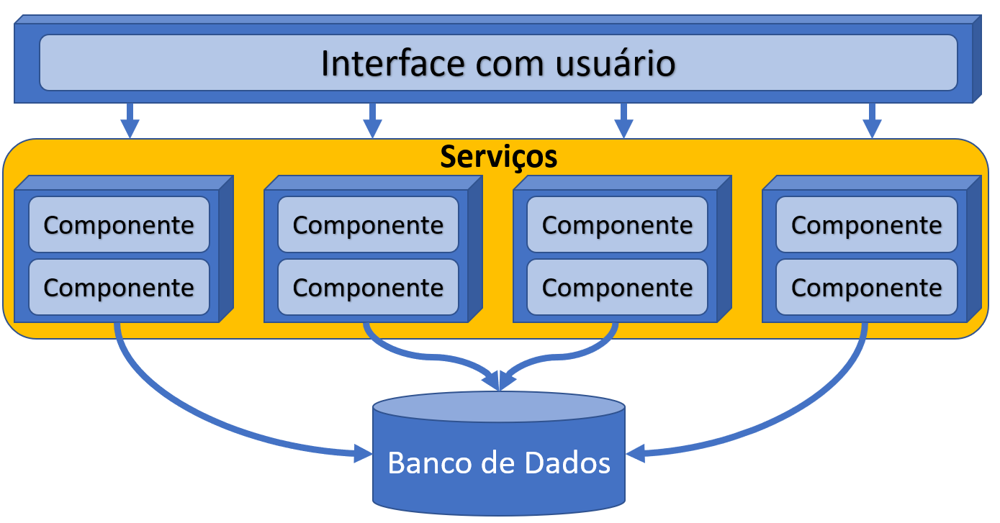
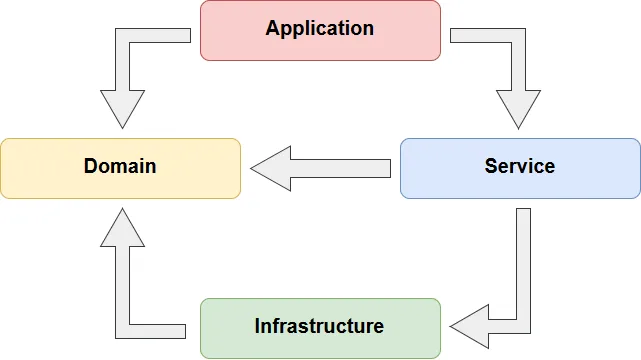
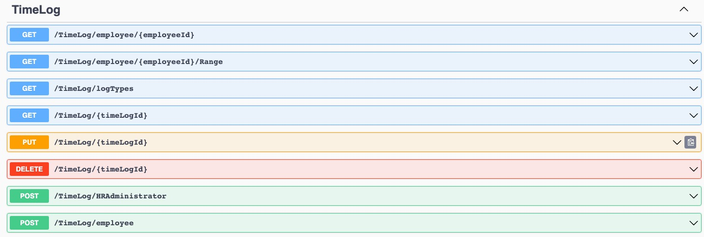
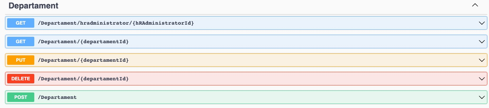
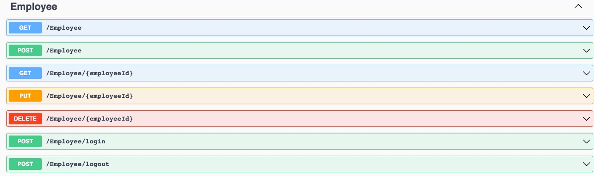
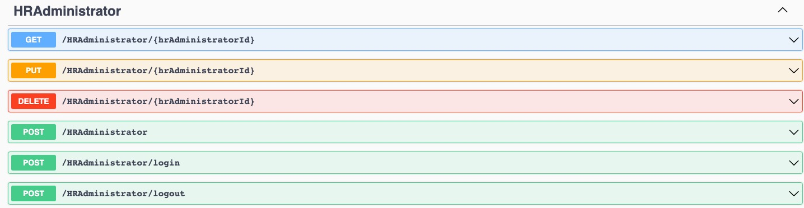
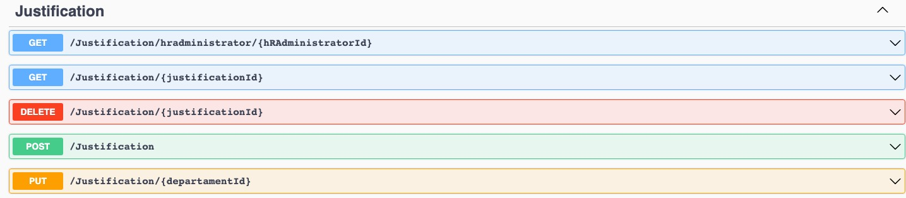
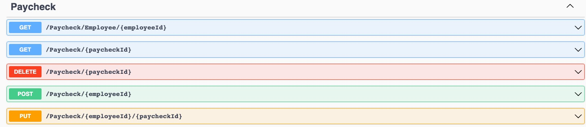
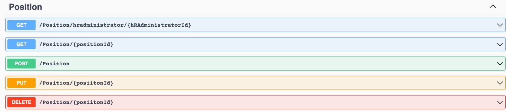

# Arquitetura da Solução

A seguir, apresentamos um diagrama de alto nível que ilustra a estrutura da solução:

Definição de como o software é estruturado em termos dos componentes que fazem parte da solução e do ambiente de hospedagem da aplicação.

## Arquitetura Backend

No caso do nosso projeto, optamos por uma abordagem baseada em serviços com uma estrutura de código que segue os princípios do Domain-Driven Design (DDD) e está dividida em camadas bem definidas.
Benefícios:
Separação de Responsabilidades: A divisão do projeto em camadas distintas, como Domain, Infrastructure, Application e Presentation, permite uma clara separação de responsabilidades. Isso torna o código mais organizado e facilita a manutenção e escalabilidade.
Modelagem de Domínio Rico: Ao seguir os princípios do DDD, focamos na modelagem do domínio, o que nos ajuda a entender melhor os requisitos do negócio e a criar um sistema que reflita com precisão o domínio do problema.
Modularização: A abordagem baseada em serviços facilita a modularização do sistema. Isso significa que cada parte da aplicação pode ser desenvolvida, testada e mantida separadamente, o que simplifica a colaboração entre equipes e a evolução do projeto.

Malefícios:
Complexidade Inicial: A estruturação em camadas e a aplicação de princípios DDD podem parecer complexas em projetos simples, adicionando algum overhead inicial de desenvolvimento.
Aprendizado e Treinamento: A equipe pode precisar de algum tempo para se familiarizar completamente com a estrutura adotada, especialmente se não estiver acostumada com o DDD.
Integração de Tecnologias: Em alguns casos, como o uso do MongoDB e Identity na camada de domínio, pode ser necessário fazer adaptações na estrutura DDD padrão, o que pode levar à introdução de classes anêmicas.

Observações Adicionais:
É importante notar que, embora tenhamos adotado o DDD como diretriz geral, em alguns casos, pragmatismo e necessidades específicas do projeto podem nos levar a fazer adaptações. Por exemplo, a integração de tecnologias como MongoDB e Identity pode exigir modificações na estrutura original do DDD. Da mesma forma, a introdução de classes anêmicas pode ser necessária para lidar com requisitos específicos do projeto.
No geral, a abordagem adotada combina a simplicidade inicial necessária para um projeto mais simples com a flexibilidade para acomodar requisitos específicos, mantendo um foco claro na modelagem de domínio e na separação de responsabilidades. Isso nos permite desenvolver um sistema que atende às necessidades do negócio e é facilmente escalável à medida que o projeto cresce.

Justificativas das Escolhas
ASP.NET 7: Escolhemos o ASP.NET 7 como framework para a API devido à sua robustez e suporte para desenvolvimento web moderno. Ele oferece uma ampla gama de recursos para criação de APIs, incluindo suporte a roteamento, autenticação e integração com bancos de dados.

MySQL e MongoDB: Optamos por usar o MySQL como banco de dados relacional para armazenar os registros de usuários devido à sua estrutura tabular adequada para esse tipo de dados. Utilizamos o MongoDB como banco NoSQL para armazenar dados diversos, como justificativas, departamentos, cargos, contracheques e registros de ponto, devido à sua flexibilidade de esquema e capacidade de armazenar dados semi-estruturados.

## Documentação da Implementação da Web API REST

### Para configurar o ambiente de desenvolvimento, siga as etapas abaixo:

Instale o Visual Studio Code, ASP.NET 7 e todas as dependências necessárias no seu sistema operacional.
Clone o repositório do projeto do GitHub para o seu ambiente local.
Configure as variáveis de ambiente necessárias, como strings de conexão para os bancos de dados MySQL e MongoDB, bem como as chaves de autenticação JWT.

### Recursos e Rotas

### Documentação da Implementação do Banco de Dados NoSQL

#### Uso do MongoDB:

O MongoDB é utilizado para armazenar dados diversos que não se encaixam bem em uma estrutura de banco de dados relacional. As coleções do MongoDB incluem:
justifications: Armazena informações sobre as justificativas fornecidas pelos usuários para edições manuais nos registros de ponto.
departaments e positions: Armazenam informações sobre os departamentos e cargos dos empregados.
paychecks: Mantém os detalhes dos contracheques gerados com base nos registros de ponto.
timelogs: Armazena os registros de ponto dos empregados, incluindo data, hora de entrada e saída, e outras informações relevantes.
Justificativas das Escolhas
Optamos por usar o MongoDB para armazenar esses dados devido à flexibilidade do esquema, que permite adicionar campos conforme necessário sem interromper as operações existentes. Além disso, o MongoDB é escalável e adequado para o armazenamento de grandes volumes de dados semi-estruturados.

### Documentação da Implementação do Banco de Dados Relacional (MySQL)

#### Uso do MySQL

O MySQL é utilizado como banco de dados relacional para armazenar informações cruciais no projeto, incluindo os registros dos usuários, bem como para manter a estrutura de autenticação e autorização da aplicação. As tabelas do MySQL incluem:

AspNetRoles: Responsável por armazenar os papéis (ou funções) disponíveis na aplicação, o que é essencial para o gerenciamento de permissões.

HRAdministrators: Mantém informações sobre os administradores de recursos humanos e seus respectivos CNPJs.

AspNetRoleClaims: Armazena reivindicações associadas a cada papel da aplicação, permitindo uma maior personalização das permissões de cada papel.

Employees: Contém informações detalhadas sobre os empregados, como data de nascimento, data de contratação, CPF, horas de trabalho diárias, e suas associações com departamentos e cargos.

AspNetUsers: Armazena os dados dos usuários, incluindo seus nomes completos, papéis, informações de contato, chaves de segurança e outros detalhes importantes. Também faz a ligação entre os usuários e seus respectivos empregados e administradores de RH.

AspNetUserClaims: Contém as reivindicações associadas a cada usuário, o que é fundamental para o gerenciamento de permissões individuais.

AspNetUserLogins: Responsável por registrar logins externos de usuários, se houver integrações de autenticação externa.

AspNetUserRoles: Mantém o relacionamento entre os usuários e os papéis que desempenham na aplicação.

AspNetUserTokens: Armazena os tokens de autenticação associados a cada usuário, usados para autenticação e recuperação de senhas.

Justificativas das Escolhas

A escolha do MySQL como banco de dados relacional baseia-se em sua estrutura tabular sólida, ideal para armazenar informações altamente estruturadas, como detalhes de usuário e funções. A utilização do MySQL oferece os seguintes benefícios:

Consistência de Dados: O MySQL garante que os dados permaneçam consistentes por meio de relações definidas e verificações de integridade referencial.

Suporte a Transações: O MySQL suporta transações ACID (Atomicidade, Consistência, Isolamento e Durabilidade), garantindo a integridade dos dados em operações críticas.

Segurança e Autenticação: É uma escolha segura para armazenar informações de autenticação, como senhas de usuário, com recursos integrados de segurança.

Escalabilidade: O MySQL é escalável, permitindo o gerenciamento de grandes volumes de dados, caso o projeto cresça.

## Diagrama de Classes

O diagrama de classes ilustra graficamente como será a estrutura do software, e como cada uma das classes da sua estrutura estarão interligadas. Essas classes servem de modelo para materializar os objetos que executarão na memória.

## Modelo ER

O Modelo ER representa através de um diagrama como as entidades (coisas, objetos) se relacionam entre si na aplicação interativa.]

## Esquema Relacional

O Esquema Relacional corresponde à representação dos dados em tabelas juntamente com as restrições de integridade e chave primária.

## Modelo Físico

Entregar um arquivo banco.sql contendo os scripts de criação das tabelas do banco de dados. Este arquivo deverá ser incluído dentro da pasta src\bd.
[Arquivo SQL](/src/bd/banco.sql)

## Tecnologias Utilizadas

## Tecnologias Utilizadas

| Ferramenta                                   | Finalidade                                                                                                                                  |
| -------------------------------------------- | ------------------------------------------------------------------------------------------------------------------------------------------- |
| Visual Studio Code e Visual Studio Community | Ambiente de desenvolvimento integrado (IDE) para desenvolver o projeto frontend e mobile                                                    |
| MySQL                                        | Banco de dados relacional utilizado para armazenar registros dos usuários                                                                   |
| MongoDB                                      | Banco de dados NoSQL utilizado para armazenar dados diversos como justificativas, departamentos, cargos, contracheques e registros de ponto |
| Swagger                                      | Ferramenta para documentação da API                                                                                                         |
| MySQL Workbench                              | Ferramenta de gerenciamento de banco de dados para o MySQL                                                                                  |
| AtlasDB                                      | Serviço de hospedagem gerenciado para o banco de dados MongoDB                                                                              |

| Linguagem/Framework | Finalidade                                                                                      |
| ------------------- | ----------------------------------------------------------------------------------------------- |
| JavaScript (JS)     | Linguagem de programação para desenvolvimento frontend e mobile com React e React Native (Expo) |
| React               | Biblioteca JavaScript para desenvolvimento da interface do usuário na web                       |
| React Native (Expo) | Framework JavaScript para desenvolvimento de aplicativos móveis para iOS e Android              |
| C#                  | Linguagem de programação para o desenvolvimento do backend da API ASP.NET 7                     |
| ASP.NET 7           | Framework para desenvolvimento da API                                                           |
| Entity Framework    | ORM (Object-Relational Mapping) para facilitar a interação com o banco de dados MySQL           |
| xUnit               | Framework de testes utilizado para escrever e executar testes unitários                         |
| JWT Bearer          | Protocolo de autenticação utilizado para gerar e validar tokens de autenticação                 |
| Identity            | Framework de autenticação e autorização para gerenciar usuários e autenticação na API           |
| AutoMapper          | Biblioteca para mapear objetos DTO (Data Transfer Objects)                                      |

## Hospedagem

- Frontend web: Vercel [Link para acesso](https://pmv-ads-2023-2-e4-proj-infra-t3-grupo-1-projeto-ponto.vercel.app/);
- Frontend mobile: Sera disponibilizado um .apk [Link para download](https://expo.dev/artifacts/eas/jE8UGUWp86kZPp4r9F7Xuf.apk) ou [Link para download](arquivos/clockin.apk);
- Backend: Azure - [Link para acesso](https://clockin.azurewebsites.net/swagger/index.html)
- Banco ORM: AWS RDS;
- Banco NoSQL: AtlasDB

## Qualidade de Software

### Funcionalidade:

- _Adequação:_ Verificar se o sistema atende aos requisitos funcionais estabelecidos para o gerenciamento de ponto.
  - Métrica: Percentagem de requisitos funcionais atendidos, incluindo o cadastro de empresas, empregados, registros de ponto e geração de contracheques.

### Confiabilidade:

- _Disponibilidade:_ Medir o tempo em que o sistema de gerenciamento de ponto está disponível para uso.
  - Métrica: Tempo médio entre falhas (MTBF) do sistema.
- _Tolerância a falhas:_ Avaliar como o sistema lida com erros e falhas nos registros de ponto.
  - Métrica: Número de registros de ponto corrigidos em um determinado período.

### Usabilidade:

- _Eficiência:_ Avaliar o desempenho e a eficiência do sistema durante o registro de ponto pelos empregados.
  - Métrica: Tempo médio para que um empregado registre sua entrada ou saída.
- _Facilidade de Aprendizado:_ Medir o tempo necessário para que um novo empregado aprenda a utilizar o sistema.
  - Métrica: Tempo médio para treinamento de novos empregados.

### Segurança:

- _Confidencialidade:_ Verificar a proteção dos dados de ponto contra acesso não autorizado.
  - Métrica: Número de violações de segurança detectadas nos registros de ponto.
- _Integridade:_ Avaliar a proteção contra modificações não autorizadas nos registros de ponto.
  - Métrica: Número de modificações não autorizadas detectadas nos registros de ponto.

### Manutenibilidade:

- _Modificabilidade:_ Avaliar a facilidade de fazer atualizações e melhorias no sistema de gerenciamento de ponto.
  - Métrica: Tempo médio para implementar uma alteração no sistema.
- _Estabilidade:_ Medir a capacidade do sistema de manter a integridade dos registros de ponto após modificações.
  - Métrica: Número de erros introduzidos após atualizações no sistema.

### Justificativas:

Essas subcaracterísticas foram escolhidas porque são fundamentais para garantir que o sistema de gerenciamento de ponto atenda às necessidades das empresas, empregados e RH. As métricas correspondentes ajudarão a equipe a monitorar o desempenho do sistema e garantir sua qualidade ao longo do desenvolvimento.
