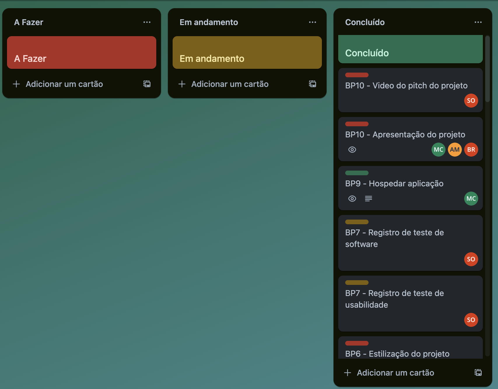
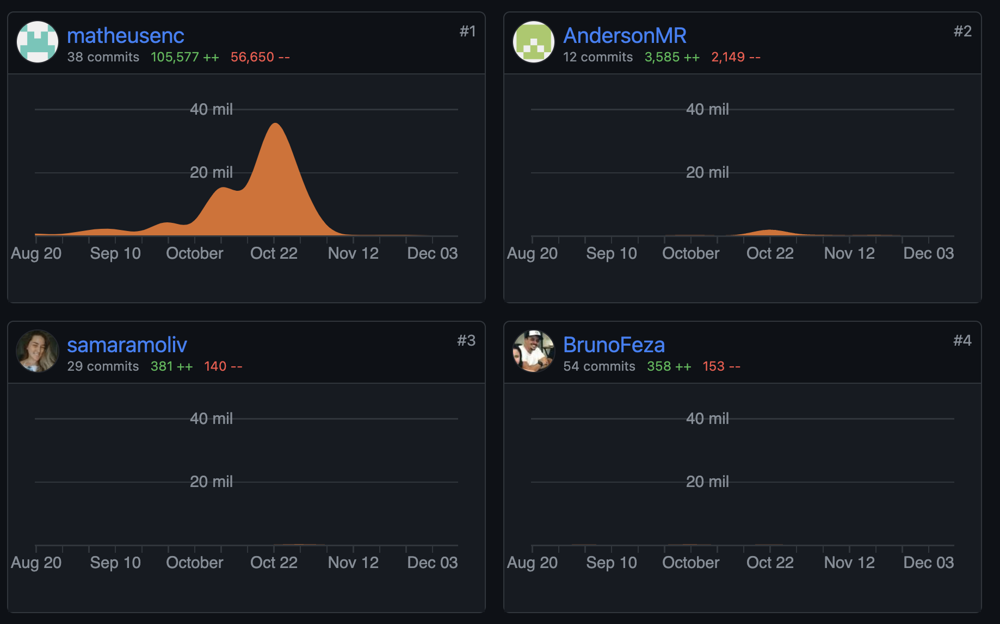
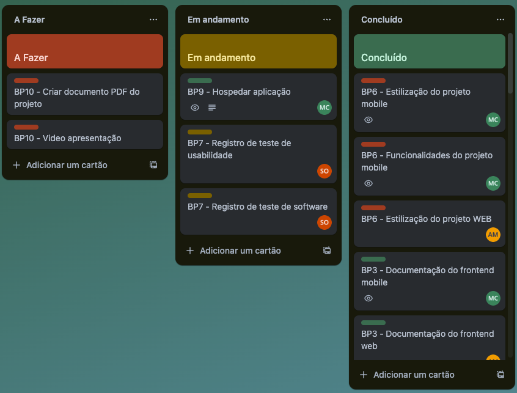
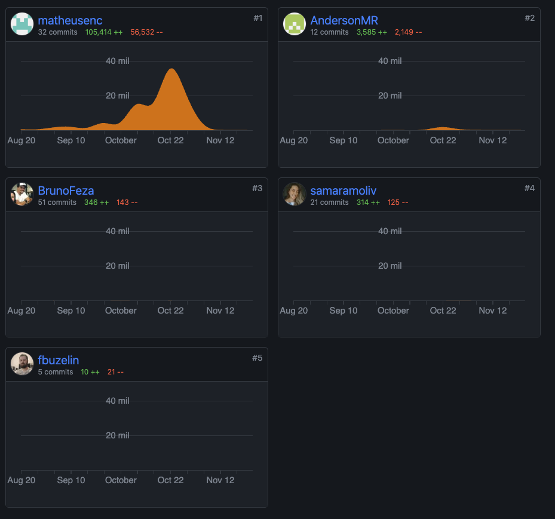
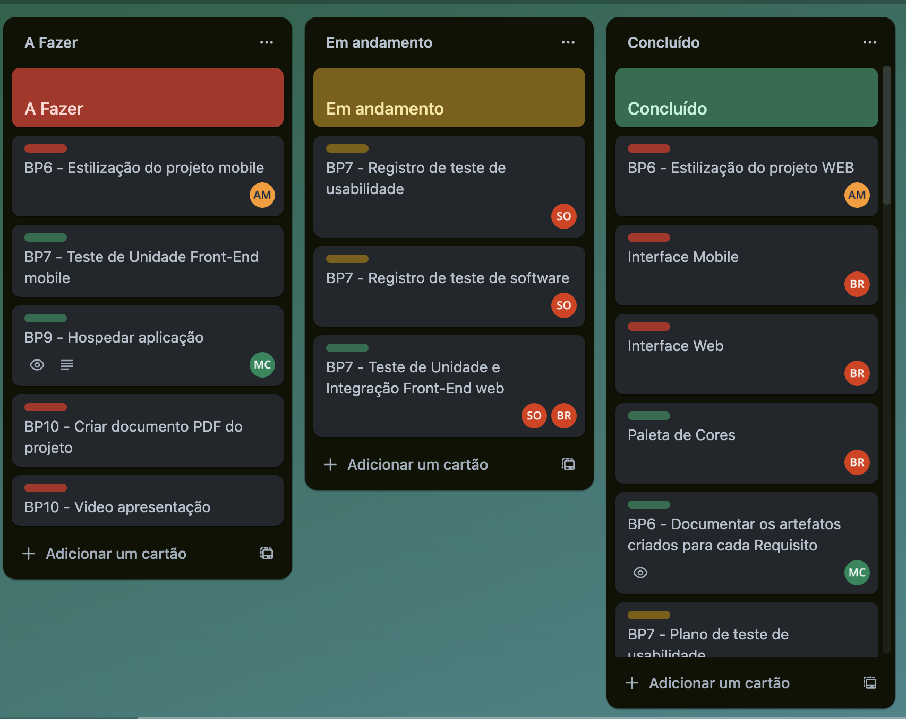
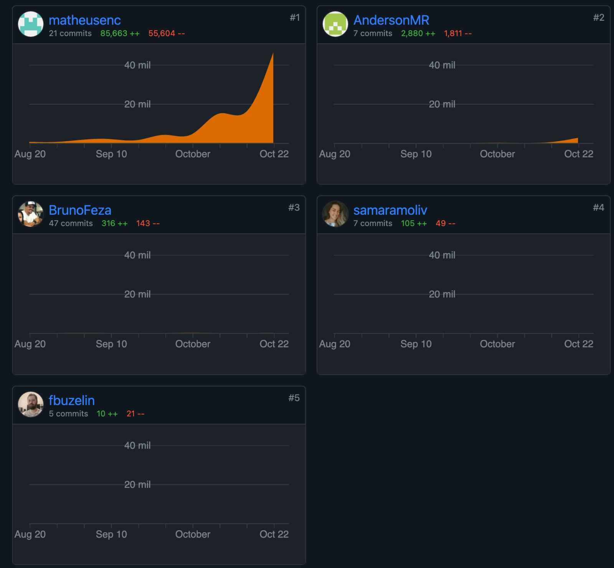

# Etapa 5

## Contribuições

### Matheus:

Codigo: Deploy.
Documentação: Apresentação do projeto.

### Anderson:

Documentação: Apresentação do projeto.

### Bruno:

Documentação: Crição dos Slides de apresentação.

### Samara:

Documentação: Criação do video de Pitch.

### Trello:

### Github:

# Etapa 4

## Contribuições

### Matheus:

Codigo: Desenvolvimento do Front-End Mobile: Funcionalidades e Estilização 
Documentaçao: Plano de teste de Software, Plano de teste de Usabilidade, Documentação do desenvolvimento Front-End Mobile e Participação da equipe. 

### Anderson:

Codigo: Correção de bugs e ajustes visuais na estilização do Front-End Web. 
Documentação: Documentação do desenvolvimento Front-End Web. 

### Bruno:
Documentação: Projeto de interface e Template Padrão da Aplicação. 

### Samara:
Documentação: Registro de Teste de Software e Registro de Teste de Usabilidade. 

### Trello:

### Github:

# Etapa 3

## Contribuições

### Matheus:

Codigo: integração do frontend web com o backend e desenvolvimento das funcinalidades prinpipais, como redirecionamento de paginas, formularios, etc. 
Documentaçao: Programação de funionalidades, Plano de teste de Software, Plano de teste de Usabilidade, Participação da equipe. 

### Anderson:

Codigo: Aplicação do template padrão a aplicação. 
Documentação: Registro de Teste de Unidade e Integração. 

### Bruno:

Codigo: Teste de Unidade e Integração. 
Documentação: Projeto de interface e Template Padrão da Aplicação. 

### Samara:

Codigo: Teste de Unidade e Integração. 
Documentação: Registro de Teste de Software e Registro de Teste de Usabilidade. 

### Trello:

### Github:

